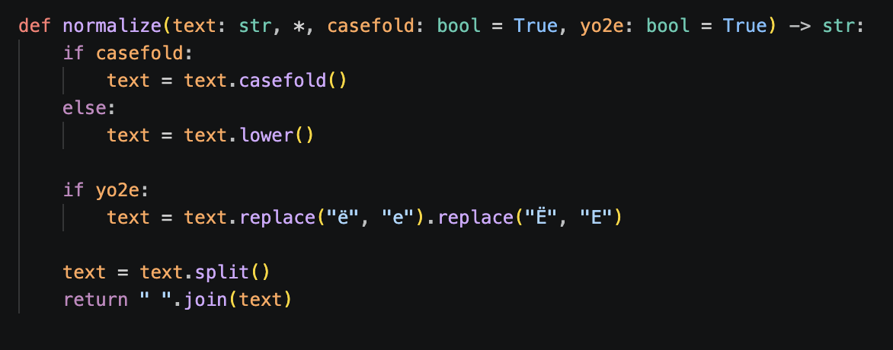
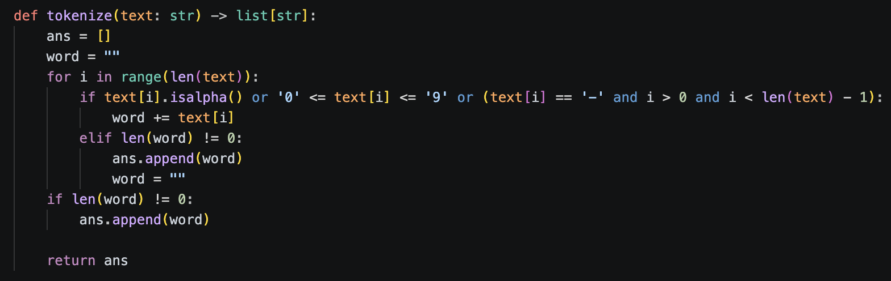
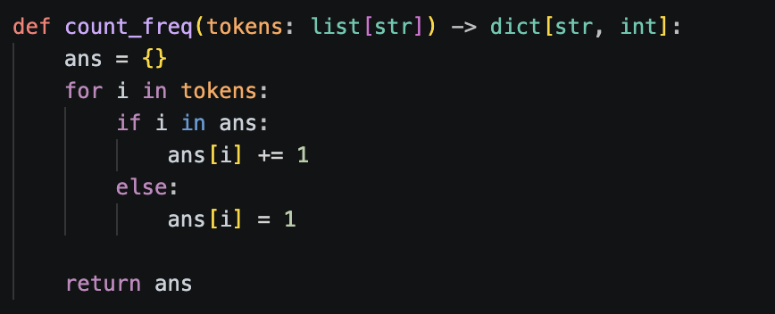
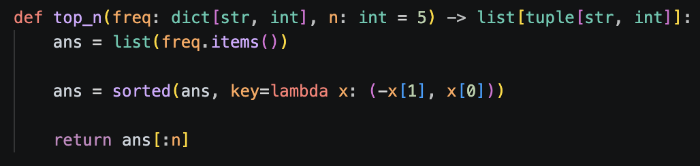

# Задание A — src/lib/text.py
## 1. normalize

> нормализует текст

## 2. tokenize

> возвращает список слов

## 3. count_freq

> возвращает частоту слов
## 4. top_n

> составляет топ_n по частоте
### вывод

