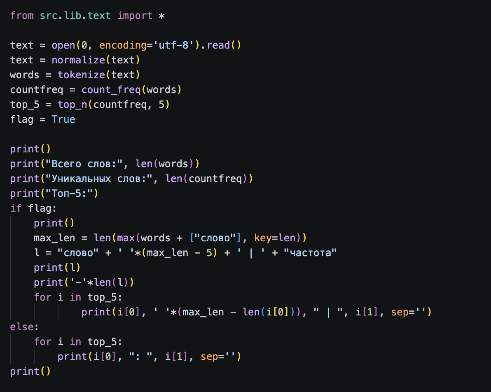

# Задание A — src/lib/text.py
## 1. normalize
```
def normalize(text: str, *, casefold: bool = True, yo2e: bool = True) -> str:
    if casefold:
        text = text.casefold()
    else:
        text = text.lower()

    if yo2e:
        text = text.replace("ё", "е").replace("Ё", "Е")

    text = text.split()
    return " ".join(text)

```
> нормализует текст

## 2. tokenize

> возвращает список слов

## 3. count_freq

> возвращает частоту слов
## 4. top_n

> составляет топ_n по частоте
### вывод


# Задание B — src/text_stats.py

