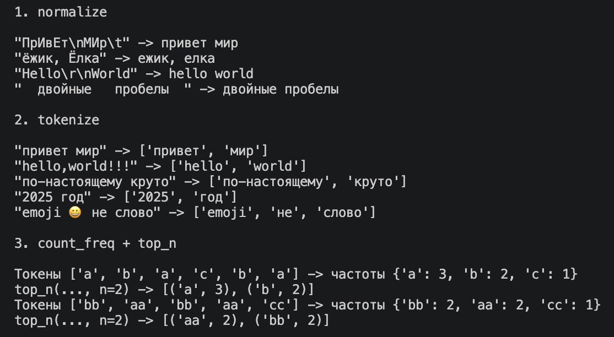
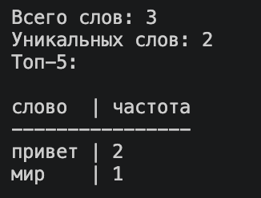

# Задание A — src/lib/text.py
## 1. normalize
```
def normalize(text: str, *, casefold: bool = True, yo2e: bool = True) -> str:
    if casefold:
        text = text.casefold()
    else:
        text = text.lower()

    if yo2e:
        text = text.replace("ё", "е").replace("Ё", "Е")

    text = text.split()
    return " ".join(text)

```
> нормализует текст

## 2. tokenize
```
def tokenize(text: str) -> list[str]:
    ans = []
    word = ""
    for i in range(len(text)):
        if text[i].isalpha() or '0' <= text[i] <= '9' or (text[i] == '-' and i > 0 and i < len(text) - 1):
            word += text[i]
        elif len(word) != 0:
            ans.append(word)
            word = ""
    if len(word) != 0:
        ans.append(word)

    return ans
```
> возвращает список слов

## 3. count_freq
```
def count_freq(tokens: list[str]) -> dict[str, int]:
    ans = {}
    for i in tokens:
        if i in ans:
            ans[i] += 1
        else:
            ans[i] = 1

    return ans
```
> возвращает частоту слов
## 4. top_n
```
def top_n(freq: dict[str, int], n: int = 5) -> list[tuple[str, int]]:
    ans = list(freq.items())
 
    ans = sorted(ans, key=lambda x: (-x[1], x[0]))

    return ans[:n]
```
> составляет топ_n по частоте
### вывод

> работа функций

# Задание B — src/text_stats.py
```
rom src.lib.text import *

text = open(0, encoding='utf-8').read()
text = normalize(text)
words = tokenize(text)
countfreq = count_freq(words)
top_5 = top_n(countfreq, 5)
flag = True

print()
print("Всего слов:", len(words))
print("Уникальных слов:", len(countfreq))
print("Топ-5:")
if flag:
    print()
    max_len = len(max(words + ["слово"], key=len))
    l = "слово" + ' '*(max_len - 5) + ' | ' + "частота"
    print(l)
    print('-'*len(l))
    for i in top_5:
            print(i[0], ' '*(max_len - len(i[0])), " | ", i[1], sep='')
else:
    for i in top_5:
        print(i[0], ": ", i[1], sep='')
print()
```
### пример вывода 
```bash
echo 'Привет, мир!' | python3 -m src.lab_3.text_stats
```

> работа text_stats.py